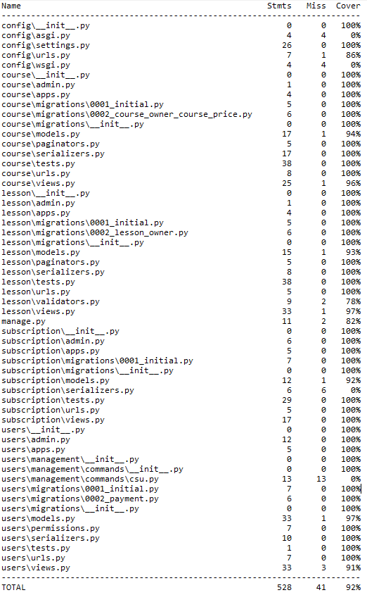

# :school: Платформа для онлайн-обучения

## Описание
### Домашние работы по блоку Django Rest Framework


## Установка и запуск

### Склонируйте репозиторий:

```bash
git clone https://github.com/CHAPAPOPA/online_learning_platform.git
```

### Перейдите в папку с проектом

```bash
cd online_learning_platform
```

### Установите зависимости:

Сначала активируем poetry
```bash
poetry shell
```

Затем установим все зависимости из pyproject.toml
```bash
poetry install
```

Для определения необходимых переменных окружения воспользуйтесь шаблоном
```bash
.env.sample
```

Сделайте миграции
```bash
python manage.py makemigrations
python manage.py migrate
```

Создайте суперпользователя
```bash
python manage.py csu
```

Загрузите фикстуры
```bash
python manage.py loaddata fixture/school.json
```

### Запуск приложения в Docker

Для сборки образа и запуска контейнера, выполните команду
   ```sh
   docker-compose up -d --build
   ```

## Запуск программы

### Сервер сайта
Для запуска сервера сайта выполните команду:
```bash
python manage.py runserver
```


---

Этот README файл предоставляет основную информацию о проекте, его установке и использовании.

## Тестирование

 